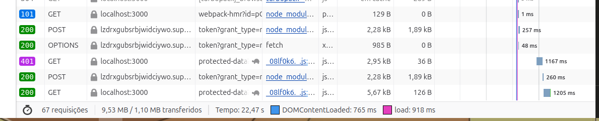
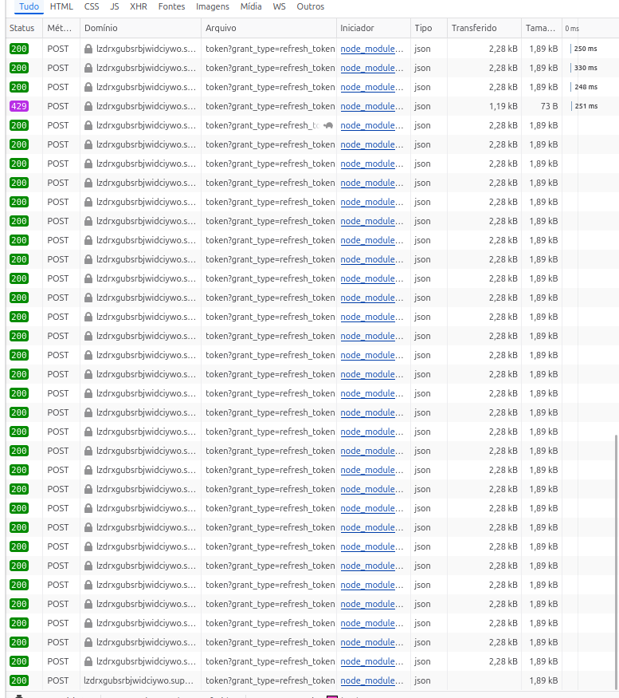
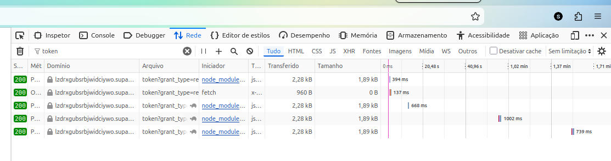
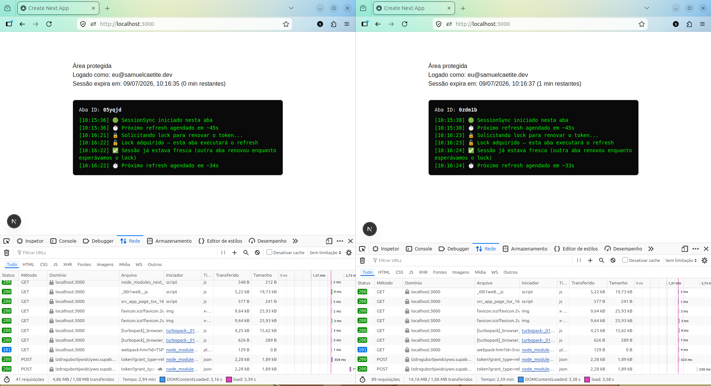

# next-session - Eliminando o deslogamento aleatório

Solução para o desafio prático: usuários da plataforma estavam sendo deslogados
aleatoriamente, sem padrão de tempo claro, com maior frequência ao trocar de
aba/dispositivo ou após período de inatividade. Este repositório documenta a
investigação da causa-raiz, a implementação da correção e as evidências
coletadas durante o processo - incluindo bugs reais encontrados (e corrigidos)
ao longo do caminho.

Stack: Next.js 16 (App Router) + Supabase Auth (GoTrue), sessão via cookie SSR
(`@supabase/ssr`).

> **Nota:** este README não é a única fonte do raciocínio por trás da solução.
> A seção [Material de apoio](#material-de-apoio) traz dois vídeos gravados
> durante a investigação, mostrando o processo de raciocínio conceitual antes
> da implementação. Também foi consultada, para fundamentar a comparação
> entre pilha (LIFO) e fila (FIFO) usada na coordenação de requisições, a
> apostila de referência da disciplina ACH2023 (Algoritmos e Estruturas de
> Dados I) da EACH-USP, de Willian Yukio Honda e Ivandré Paraboni:
> [ACH2023.pdf](https://www.each.usp.br/digiampietri/ACH2023/ACH2023.pdf).

---

## Sumário

1. [Causa-raiz](#causa-raiz)
2. [Arquitetura da solução](#arquitetura-da-solução)
3. [Diário de bordo](#diário-de-bordo)
4. [Demonstração multi-aba](#demonstração-multi-aba)
5. [Material de apoio](#material-de-apoio)
6. [Como rodar o projeto](#como-rodar-o-projeto)
7. [Como reproduzir os testes](#como-reproduzir-os-testes)
8. [Decisões e trade-offs](#decisões-e-trade-offs)

---

## Causa-raiz

### O mecanismo do bug

O Supabase Auth (GoTrue) emite dois tokens por sessão:

- **Access token** (JWT): curta duração (padrão 1h), stateless - validado só
  pela assinatura, sem consulta ao servidor a cada uso.
- **Refresh token**: longa duração, mas **de uso único** (rotation habilitado
  por padrão). Ao trocar por um novo par de tokens, o token antigo é
  imediatamente invalidado. Essa é uma proteção contra replay de token
  roubado - mas tem uma consequência importante: **a segunda tentativa de uso
  do mesmo refresh token, mesmo que "legítima", é rejeitada como se fosse um
  ataque.**

O problema: nesta aplicação, existem **múltiplas fontes independentes**
tentando renovar a sessão de forma concorrente:

1. O **proxy** do Next.js (antigo `middleware.ts`), que roda a cada navegação
   de página e chama `supabase.auth.getUser()` - que internamente já tenta
   renovar o token se estiver perto de expirar.
2. O **client no browser**, com sua própria instância do Supabase client,
   seu próprio timer de refresh.
3. **Múltiplas abas abertas**, cada uma com sua própria cópia em memória do
   client, todas lendo/escrevendo o mesmo cookie compartilhado no disco.

Quando duas (ou três) dessas fontes decidem renovar no mesmo instante - o que
é mais provável exatamente quando o token está perto de expirar, ou quando o
usuário troca de aba/volta de inatividade e várias fontes disparam requisições
em paralelo - todas leem o **mesmo** refresh token do cookie antes que
qualquer uma escreva a atualização. A primeira a completar "vence" a corrida;
as demais enviam um refresh token que acabou de ser invalidado, e recebem
`400 invalid_grant (Already Used)`.

Se o código do cliente trata qualquer erro de refresh como "sessão morta"
(que era o comportamento inicial desta implementação, antes de corrigido),
isso derruba a sessão de um usuário que, do ponto de vista do servidor,
**continua legitimamente autenticado** - só que a renovação foi feita por
outra fonte.

Isso explica o padrão relatado: sem horário fixo (é uma race condition, não
um bug determinístico), mais frequente ao trocar de aba/dispositivo ou após
inatividade (momentos em que múltiplas fontes tendem a disparar renovação ao
mesmo tempo), sem relação com mudança de infraestrutura (a condição de corrida
pode ter existido desde sempre, só variando de visibilidade com latência de
rede e volume de uso).

### Uma analogia útil (e suas diferenças importantes)

Esse é o mesmo padrão de bug - chamado de **lost update** ou **stale
read/read-modify-write sem coordenação** - encontrado num cenário bem
diferente: um carrinho de e-commerce salvo em `sessionStorage`, atualizado
com o padrão `setState(prev => ...)`. Se duas abas adicionavam produtos
diferentes ao mesmo carrinho, cada uma lia o `prev` desatualizado e
sobrescrevia a mudança da outra - no checkout, só sobrevivia o item da
última aba a escrever.

A diferença crucial: no carrinho, o "servidor" (storage) aceita qualquer
escrita - o problema é uma perda **silenciosa** de dado. No caso do
Supabase, o servidor **rejeita ativamente** a segunda escrita (401), e o
cliente interpreta essa rejeição - erroneamente - como fim de sessão.

Isso também significa que a solução não pode ser só "reconciliar depois do
fato" (como um listener de `storage` que atualiza o carrinho após a
escrita). Como o servidor não perdoa a segunda tentativa, é preciso
**prevenir a segunda tentativa antes que ela aconteça** - daí a escolha por
um lock explícito (Web Locks API) em vez de só um listener reativo
(BroadcastChannel sozinho).

---

## Arquitetura da solução

### Requisito 1: Fluxo correto de sessão com `@supabase/ssr`

- **`src/proxy.ts`** (middleware/proxy): roda em toda navegação, chama
  `getUser()` (que valida o JWT contra o servidor - diferente de
  `getSession()`, que só lê o cookie sem validar) e reescreve os cookies a
  cada request, mantendo servidor e cliente consistentes.
- **`src/lib/supabase/server.ts`**: client de leitura para Server Components
  e Route Handlers.
- **`src/lib/supabase/client.ts`**: client para uso em Client Components -
  com `autoRefreshToken: false`, já que o refresh proativo é coordenado
  manualmente pelo `SessionSync` (ver requisito 2), não pelo timer nativo do
  SDK (que rodaria de forma independente em cada aba).

### Requisito 2: Coordenação de refresh entre abas

**`src/components/session-sync.tsx`**, montado no layout raiz, implementa:

- **Web Locks API** (`navigator.locks.request`): garante que só uma aba por
  vez execute o refresh de fato. As demais aguardam o lock e, ao adquiri-lo,
  primeiro checam se a sessão já foi renovada por quem tinha o lock antes -
  só disparam refresh próprio se ainda for necessário.
- **BroadcastChannel**: a aba que renova avisa as demais, que relêem a
  sessão do cookie em vez de tentar renovar por conta própria.
- **Buffer proporcional** (não fixo): o refresh é agendado a 75% da vida
  útil do token decorrida, com piso mínimo de 5s entre agendamentos - ver
  [Bug 1](#bug-1-loop-de-refresh-instantâneo-com-expiração-curta) para o
  porquê disso não ser um valor fixo.
- **Recuperação de falso-positivo**: se mesmo assim o refresh falhar com
  "Already Used" (porque uma quarta fonte - o proxy - venceu a corrida antes
  do lock sequer ser solicitado), o código relê `getSession()` antes de
  declarar a sessão morta - ver
  [Bug 3](#bug-3-falso-positivo-de-logout-em-refresh_token_already_used).

### Requisito 3: UX resiliente a 401

**`src/lib/fetch-with-auth-retry.ts`**: wrapper de `fetch` que, ao receber
401, solicita o mesmo lock usado pelo `SessionSync` (evitando competir com
ele), tenta `refreshSession()`, e só então refaz a requisição original uma
vez. Só redireciona para `/login` se a recuperação falhar de fato.

Evidência da sequência completa (401 → refresh → retry bem-sucedido, via
fault injection controlada - ver [seção de reprodução](#como-reproduzir-os-testes)):



### Requisito 4

Ver seção [Demonstração multi-aba](#demonstração-multi-aba) abaixo.

---

## Diário de bordo

Bugs reais descobertos e corrigidos durante a implementação - mantidos aqui
porque documentam decisões e porque a investigação em si é parte do que este
desafio pede.

### Bug 1: Loop de refresh instantâneo com expiração curta

**Sintoma:** ao configurar expiração de JWT curta (60s, só para acelerar
testes), o usuário era deslogado em minutos, mesmo com uma única aba aberta.

**Investigação:** a aba de Rede revelou uma rajada de dezenas de chamadas
consecutivas a `token?grant_type=refresh_token`, incluindo um `429` (rate
limit do Supabase).

**Causa-raiz:** o agendamento usava um buffer fixo (`expiração - 60s`). Com
expiração total de 60s, o cálculo resultava em delay zero - cada refresh
gerava um token que expirava em 60s, disparando outro refresh imediato, em
loop.

**Correção:** buffer fixo substituído por uma fração da vida útil real do
token (75% decorrido) + piso mínimo de 5s entre agendamentos, eliminando o
loop independentemente do valor de expiração configurado.

**Evidências:**

Antes - rajada de chamadas consecutivas terminando em `429` (rate limit):



Depois - chamadas espaçadas de forma consistente, sem `429`:



### Bug 2: Proxy redirecionando rotas de API para /login (HTML) em vez de 401 (JSON)

**Sintoma:** ao testar o requisito 3 com um token inválido, o client recebia
`SyntaxError: JSON.parse: unexpected character` em vez de um 401 tratável.

**Causa-raiz:** o `matcher` do proxy cobre todas as rotas, incluindo
`/api/*`. A lógica de redirecionamento não fazia exceção para rotas de API -
qualquer usuário não autenticado era redirecionado para a página HTML de
login, mesmo em uma chamada de API que esperava JSON.

**Correção:** rotas sob `/api` agora recebem `NextResponse.json({ error:
'Unauthorized' }, { status: 401 })` em vez de redirect.

### Bug 3: Falso-positivo de logout em refresh_token_already_used

**Sintoma:** ao reiniciar o servidor com o token expirado, duas abas
simultâneas geravam `AuthApiError: Invalid Refresh Token: Already Used` e uma
delas deslogava - mesmo a sessão continuando válida.

**Causa-raiz:** o proxy (rodando no servidor, em requisições de RSC/navegação)
e o `SessionSync` (rodando no client) chegaram a competir pelo mesmo refresh
token. Quem perdia a corrida recebia o erro e, no código anterior, tratava
qualquer erro de refresh como sessão morta - sem checar se a sessão já tinha
sido renovada por outra via.

**Correção:** antes de emitir `signed-out`, o código agora relê `getSession()`
- se ela já estiver válida (renovada por outra fonte), a aba segue
normalmente, sem forçar logout.

**Evidência:**



### Bug 4: Mismatch de hidratação no painel de debug

**Sintoma:** `Hydration failed` ao gerar um ID aleatório de aba via
`useState(() => Math.random()...)`.

**Causa-raiz:** a função de inicialização do `useState` roda tanto no SSR
quanto na hidratação do client - `Math.random()` gera valores diferentes em
cada execução.

**Correção:** o ID passou a ser gerado dentro de um `useEffect` (só no
client, após a montagem), não durante o render inicial.

---

## Demonstração multi-aba

**Setup:** duas janelas do navegador lado a lado (mesmo perfil, cookies
compartilhados), mesmo usuário logado, expiração de JWT configurada em 60s
para acelerar o ciclo de observação.

**Resultado observado ao longo de múltiplos ciclos de expiração
consecutivos:** nenhuma das duas abas foi deslogada. Na maioria dos ciclos,
**nenhuma das duas precisou executar o refresh de fato** - uma terceira
fonte (o proxy, acionado por requisições de RSC/navegação em segundo plano)
consistentemente renovava a sessão primeiro, e ambas as abas, ao tentar
adquirir o lock, encontravam a sessão já fresca e simplesmente reagendavam o
próximo ciclo.

Isso é, na prática, uma demonstração mais forte do que "duas abas não
competem entre si": **três fontes concorrentes** (proxy + duas abas)
tentando renovar a mesma sessão, ao longo de múltiplos ciclos, nunca geraram
logout nem erro visível ao usuário. O mecanismo de lock + releitura de sessão
antes de desistir absorve a concorrência independentemente de quantas fontes
participem - não só entre abas do client, mas entre client e servidor.

**Evidência** - duas abas, logs de sincronização lado a lado, relatando
"sessão já estava fresca" em vez de erro, ao longo de múltiplos ciclos:


---

## Material de apoio

Antes de codar, o raciocínio conceitual sobre a causa-raiz foi registrado em
dois vídeos:

- **[Vídeo 1](https://youtu.be/w2jHlw2ko0I)** - primeira aproximação
  conceitual do problema, comparando com um bug real e anterior de
  sincronização de carrinho de e-commerce entre abas (via `sessionStorage`),
  e concluindo por que "só ouvir e propagar mudanças" (padrão adequado para
  o carrinho) não seria suficiente para o caso do refresh token, que exige
  prevenção via lock, não só reconciliação posterior.
- **[Vídeo 2](https://youtu.be/5H2BypRsig4)** - versão estruturada da
  mesma análise: diferença entre pilha (LIFO) e fila (FIFO) para
  processamento de requisições, o papel do `BroadcastChannel` como
  mecanismo de broadcast entre contextos, e a justificativa para a Web
  Locks API como orquestrador central que pausa e libera requisições
  concorrentes.

Ambos os vídeos são conceituais (sem código), documentando o processo de
raciocínio antes da implementação.

---

## Como rodar o projeto

```bash
git clone <repo>
cd next-session
npm install
cp .env.example .env.local
# preencher NEXT_PUBLIC_SUPABASE_URL e NEXT_PUBLIC_SUPABASE_ANON_KEY
# com os dados do seu projeto Supabase (Settings > API Keys)
npm run dev
```

Crie um usuário de teste em **Authentication → Users → Add user** no
dashboard do Supabase, marcando "Auto Confirm User".

### Variáveis de ambiente

| Variável | Descrição |
|---|---|
| `NEXT_PUBLIC_SUPABASE_URL` | URL do projeto Supabase |
| `NEXT_PUBLIC_SUPABASE_ANON_KEY` | Publishable/anon key do projeto |
| `NEXT_PUBLIC_DISABLE_PROACTIVE_REFRESH` | `true` desativa o refresh proativo do `SessionSync`, útil para testar isoladamente o requisito 3 (resiliência a 401) sem a rede de segurança do refresh proativo mascarar o teste. Deixe `false` no uso normal. |

---

## Como reproduzir os testes

### Requisito 2 (coordenação multi-aba)
1. Configure uma expiração de JWT curta no Supabase (Settings → JWT Keys →
   Legacy JWT Secret → JWT expiry limit), ex.: 60s - **apenas para teste**;
   os próprios docs do Supabase recomendam não usar valores abaixo de 5min
   em produção, por causa de clock skew entre dispositivos.
2. Abra duas janelas (não abas do mesmo grupo, para evitar interferência de
   foco) lado a lado, logado com o mesmo usuário nas duas.
3. Aguarde sem interagir - os logs do `SessionSync` aparecem no painel preto
   da página inicial.

### Requisito 3 (resiliência a 401)
Use o parâmetro de fault injection da rota de exemplo, que força um 401 uma
única vez por ciclo de vida do servidor:
```
GET /api/protected-data?simulateAuthFailure=true
```
Chamado pelo botão "Chamar rota protegida" em `/dashboard`. Reinicie o
servidor entre execuções para resetar o estado do fault injection.

---

## Decisões e trade-offs

- **`autoRefreshToken: false`** no client: decisão deliberada para não ter
  dois mecanismos de refresh proativo brigando entre si (o nativo do SDK e o
  `SessionSync`). Trade-off: se `SessionSync` não montar por algum motivo, não
  há refresh proativo nenhum - mitigado pelo fato de o proxy também renovar
  em navegações de página.
- **Threshold de 75% da vida útil**, não um valor fixo em segundos: evita o
  bug do loop instantâneo (bug 1) e escala corretamente para qualquer
  configuração de expiração, de 60s a 1h+.
- **Fault injection ao invés de esperar expiração real** para testar o
  requisito 3: o proxy já renova proativamente na maioria dos casos reais,
  mascarando o cenário de 401 genuíno - a injeção controlada torna o teste
  determinístico e reproduzível.
- **Com mais tempo**, o próximo passo seria: (a) mover a checagem de
  "still needs refresh" para comparar contra o `access_token` em si (não só
  `expires_at`), reduzindo ainda mais a chance de corrida; (b) adicionar
  telemetria real (não só console.log) para monitorar em produção a
  frequência de "sessão já estava fresca" vs "refresh executado", validando
  a hipótese em escala.